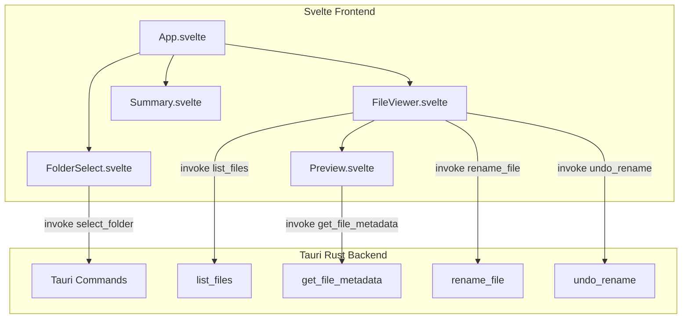
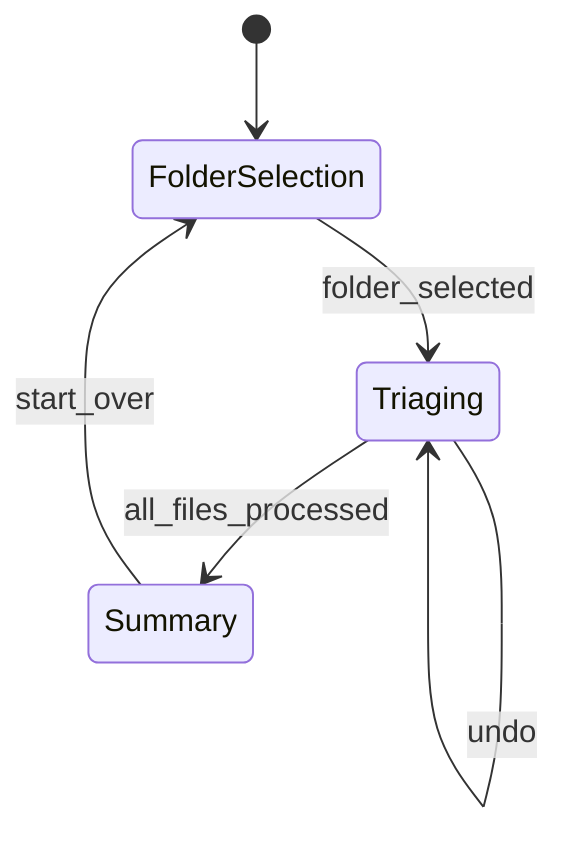

# File Triage Desktop Application

## Architecture Overview



## Project Structure

```
folder-cleanup-swipe/
├── src-tauri/
│   ├── Cargo.toml
│   ├── tauri.conf.json
│   ├── src/
│   │   ├── main.rs
│   │   └── lib.rs          # Tauri commands
├── src/
│   ├── App.svelte          # Main app with state machine
│   ├── main.ts             # Entry point
│   ├── app.css             # Global styles
│   ├── lib/
│   │   ├── FolderSelect.svelte
│   │   ├── FileViewer.svelte
│   │   ├── Preview.svelte
│   │   └── Summary.svelte
│   └── types.ts            # TypeScript types
├── index.html
├── package.json
├── svelte.config.js
├── vite.config.ts
└── tsconfig.json
```

## Backend Implementation (Rust)

### Tauri Commands in `src-tauri/src/lib.rs`

| Command | Parameters | Returns | Purpose |

|---------|------------|---------|---------|

| `list_files` | `folder_path: String` | `Vec<FileInfo>` | List all files in folder (non-recursive) |

| `get_file_metadata` | `file_path: String` | `FileMetadata` | Get file type, size, preview data |

| `rename_file` | `old_path: String, new_path: String` | `Result<()>` | Rename file (add DELETE prefix) |

| `undo_rename` | `old_path: String, new_path: String` | `Result<()>` | Reverse a rename operation |

| `read_text_preview` | `file_path: String, max_bytes: usize` | `String` | Read first N bytes of text file |

### FileInfo Struct

```rust
struct FileInfo {
    path: String,
    name: String,
    file_type: String, // "image", "pdf", "text", "other"
    size: u64,
}
```

## Frontend Implementation (Svelte)

### State Flow



### Key Components

1. **App.svelte** - State machine: `idle` → `triaging` → `complete`
2. **FolderSelect.svelte** - Button to open native folder dialog
3. **FileViewer.svelte** - Main triage view with:

   - Current file preview
   - Progress indicator (X of N)
   - Keyboard handler (←/→/Backspace)
   - Action history for undo

4. **Preview.svelte** - Renders based on file type:

   - Images: `` tag with file URL
   - PDF: `<iframe>` or simple icon fallback
   - Text: First 500 chars in `<pre>` block
   - Other: File icon with name

5. **Summary.svelte** - Shows kept vs marked-for-deletion counts

### Keyboard Bindings

- `→` (ArrowRight): Keep file, advance to next
- `←` (ArrowLeft): Mark for deletion (add `DELETE_` prefix), advance
- `Backspace`: Undo last action

## UI Design

- **Colors**: White background (`#fafafa`), dark text (`#171717`), subtle borders (`#e5e5e5`)
- **Typography**: System font stack, 16px base
- **Layout**: Centered container (max-width 800px), generous padding
- **Components**: Minimal borders, no shadows, subtle hover states

## Setup Instructions (to be included in README)

```bash
# Prerequisites: Node.js, Rust, Tauri CLI

# Install dependencies
npm install

# Development
npm run tauri dev

# Build for production
npm run tauri build
```

## Implementation Order

1. Initialize Tauri + Svelte project
2. Implement Rust backend commands
3. Build folder selection flow
4. Create file viewer with keyboard navigation
5. Implement preview component
6. Add undo mechanism
7. Build summary screen
8. Apply minimal styling